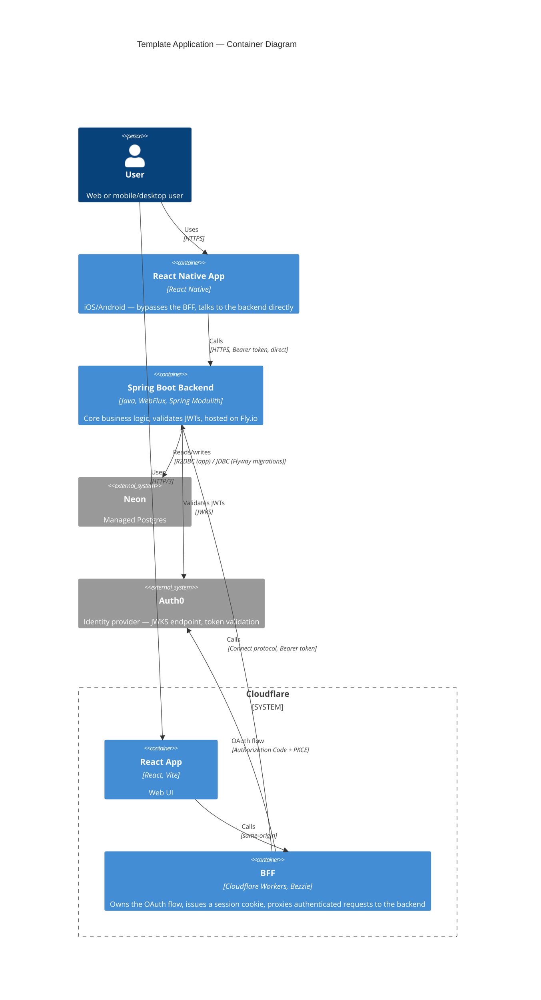

# Template Application — Planning

Architecture, decisions, and workflow guide for the template application stack. Read this before working in the frontend or backend repos.

## Repos

| Repo | Purpose |
|---|---|
| [template-application-planning](https://github.com/neilpmas/template-application-planning) | This repo — architecture, decisions, workflow guide |
| [template-application-frontend](https://github.com/neilpmas/template-application-frontend) | React + Cloudflare Workers BFF |
| [template-application-backend](https://github.com/neilpmas/template-application-backend) | Spring Boot backend |

---

## Architecture Overview



### Client model

The BFF exists solely to protect browser-based clients — browsers cannot store tokens safely. Mobile and desktop clients have secure OS credential stores and talk directly to Spring Boot.

| Client | Auth pattern | Talks to |
|---|---|---|
| React (web) | Session cookie via BFF — JWTs never touch the browser | BFF → Spring Boot |
| React Native (mobile) | Bearer token direct from Auth0 | Spring Boot directly |
| Desktop | Bearer token direct from Auth0 | Spring Boot directly |

Spring Boot validates JWTs from all clients identically — it doesn't distinguish between BFF-forwarded and direct requests.

---

## Stack

### Frontend & BFF — Turborepo monorepo

| Technology | Version | Purpose |
|---|---|---|
| React | 19 | Web UI |
| Vite | 8 | Build tool |
| Tailwind CSS | 4 | Styling |
| shadcn/ui | — | Component library (Radix UI, copy-paste, you own the code) |
| Turborepo | — | Monorepo — web, mobile, BFF as packages |
| Cloudflare Workers | — | BFF, auth proxy, Connect protocol → backend |
| [Bezzie](https://github.com/neilpmas/bezzie) | — | BFF OAuth 2.0 library (open source) |
| Cloudflare KV | — | Session storage |
| React Native | — | iOS and Android (Auth0 RN SDK, `expo-secure-store`) |

```
<app>/
  apps/
    web/        ← React (Cloudflare Pages)
    mobile/     ← React Native (iOS + Android)
    bff/        ← Cloudflare Workers + Bezzie
  packages/
    proto/      ← Protobuf definitions + generated TypeScript Connect client
    types/      ← shared TypeScript types
    api-client/ ← shared API client
```

### Backend

| Technology | Version | Purpose |
|---|---|---|
| Spring Boot | 4.1.0 | Core business logic |
| Spring Modulith | 2.1.0 | Enforces module boundaries |
| Java | 26 | Language |
| Maven | — | Build (wrapper included) |
| Spring Data R2DBC | — | Reactive database access |
| Flyway | 13.3.0 | Schema migrations |
| [connectrpc-spring-boot-starter](https://github.com/neilpmas/connectrpc-spring-boot) | 0.2.1 | Connect protocol endpoint (Maven Central) |

### Database

**[Neon](https://neon.tech)** — managed serverless Postgres. One Neon project per app.

> **Critical:** Always use the **direct connection string** (port 5432), not the Neon pooler URL (port 6543). The transaction-mode pooler breaks R2DBC prepared statements.

Two connection strings are needed — one for R2DBC (the app) and one for JDBC (Flyway migrations only):

| Variable | Format | Used by |
|---|---|---|
| `R2DBC_URL` | `r2dbc:postgresql://ep-xxx.us-east-2.aws.neon.tech:5432/template` | Spring Data R2DBC |
| `DATABASE_URL` | `jdbc:postgresql://ep-xxx.us-east-2.aws.neon.tech:5432/template` | Flyway |

**Cost at rest:** Free tier. Neon autosuspends compute after ~5 minutes of inactivity; cold start is ~500ms. Pick the Neon region closest to your Fly.io machine.

### Authentication

**[Auth0](https://auth0.com)** — identity and access management.

One Auth0 tenant shared across all apps on the stack. Same user identity, SSO possible, users don't re-register per app.

Per app, register:
- One **Regular Web Application** (for the BFF — has a client secret)
- One **API** (represents the Spring Boot backend, defines the audience)

RBAC roles and permissions are scoped per API — no bleed between apps.

---

## Protocol Decisions

### Browser → Cloudflare edge
HTTP/3 — handled automatically by Cloudflare. No configuration needed.

### BFF → Spring Boot
**Connect protocol** — Cloudflare Workers calls Spring Boot via [Connect protocol](https://connectrpc.com) (binary format, `POST /connect/{service}/{method}`) using `fetch()`.

**Why not native gRPC:** workerd (the Cloudflare Workers runtime) has no `http2.connect` — Workers cannot originate an HTTP/2 connection with trailers, which gRPC requires.

**Why not gRPC-Web:** gRPC-Web is a *different wire format* from native gRPC (length-prefixed frames with a trailer-in-body encoding), not just gRPC-over-HTTP/1.1. It looked like the answer here but was never actually compatible with this backend's plain gRPC service (`net.devh:grpc-spring-boot-starter`) — the two speak incompatible wire formats, and there's no gRPC-Web server implementation for Spring Boot to bridge the gap.

**The fix:** [`connectrpc-spring-boot-starter`](https://github.com/neilpmas/connectrpc-spring-boot) — a real, published library (Maven Central, `dev.neilmason:connectrpc-spring-boot-starter`) built specifically to fill this gap, since Connect protocol had no official Java/Spring implementation. It auto-configures a `/connect/{service}/{method}` endpoint directly from existing gRPC service definitions via reflection, so existing gRPC service implementations are reused as-is — no hand-rolled endpoint code in any app repo.

**Cloudflare Workers `fetch()` caveat:** `@connectrpc/connect-web` hardcodes `redirect: "error"` on its `fetch()` calls, which is valid in browsers but throws `TypeError: Invalid redirect value` under workerd (only `"follow"`/`"manual"` are supported there). The BFF wraps `fetch` (`workersFetch.ts`) to strip that option before delegating to the real `fetch()`.

### Mobile/Desktop → Spring Boot
Standard HTTPS with Bearer token. REST by default.

### Spring Boot → Neon
**R2DBC** over TCP — reactive, non-blocking. The app uses Spring Data R2DBC for all database access.

**Flyway** uses a separate JDBC connection for migrations only — JDBC is synchronous and Flyway requires it.

Both must use the **direct** Neon endpoint (port 5432), not the pooler.

---

## Authentication Detail

### Web: BFF-based OAuth (BCP212)

The BFF pattern keeps JWTs out of the browser entirely.

**Auth0 setup:**

| Setting | Description |
|---|---|
| `AUTH0_DOMAIN` | e.g. `your-tenant.auth0.com` |
| `AUTH0_CLIENT_ID` | Web application client ID |
| `AUTH0_CLIENT_SECRET` | Web application client secret — held only by the BFF Worker |
| `AUTH0_AUDIENCE` | API identifier — must match `AUTH0_AUDIENCE` in the backend |

The audience value must be identical in the BFF and Spring Boot. If they don't match, JWT validation fails.

**Login flow:**
```
React → BFF /auth/login → Auth0 (Authorization Code + PKCE)
                                  │
                             code returned
                                  │
             BFF exchanges code for tokens → stored in Cloudflare KV
             BFF issues HttpOnly; Secure; SameSite=Strict session cookie → React
```

**Per-request flow:**
```
React (session cookie) → BFF → validates session, refreshes token if expired
                              → Spring Boot (Connect protocol + Authorization: Bearer <token>)
```

### Mobile: RFC 8252 (OAuth for Native Apps)

```
React Native → Auth0 SDK (Authorization Code + PKCE)
                       │
                  tokens stored in iOS Keychain / Android Keystore (expo-secure-store)
                       │
React Native (Authorization: Bearer <token>) → Spring Boot (direct)
```

### Backend: Resource server

Spring Boot validates JWTs on every protected request using Auth0's JWKS endpoint. Works identically for BFF-forwarded and direct mobile requests.

```yaml
spring:
  security:
    oauth2:
      resourceserver:
        jwt:
          issuer-uri: ${AUTH0_ISSUER_URI}   # https://your-tenant.auth0.com/
          audiences: ${AUTH0_AUDIENCE}       # https://api.yourproject.com
```

Roles and permissions are defined in Auth0, included in the JWT as a `permissions` claim. Enable **RBAC** and **Add Permissions in the Access Token** in the Auth0 API settings.

```java
@PreAuthorize("hasAuthority('read:data')")
```

---

## Local Development

### Prerequisites

| Tool | Version | Install |
|---|---|---|
| Java | 26 | `brew install openjdk@26` or [SDKMAN](https://sdkman.io) |
| Node.js | 20+ | [nodejs.org](https://nodejs.org) or `brew install node` |
| npm | 11 | included with Node |
| Docker | any | [Docker Desktop](https://www.docker.com/products/docker-desktop) |
| Wrangler | latest | `npm install -g wrangler` |
| Buf CLI | latest | `brew install bufbuild/buf/buf` (only if regenerating proto) |

### Stack when running locally

```
React (Vite dev server — port 5173)
    ↓
Cloudflare Workers (wrangler dev — port 8787)
    ↓
Spring Boot (port 8080 HTTP, port 9090 gRPC)
    ↓
Postgres (Docker — port 5432)
```

### Getting started (all three repos)

1. **Start Postgres:**
   ```bash
   docker run -d -p 5432:5432 -e POSTGRES_DB=template -e POSTGRES_PASSWORD=password postgres:17
   ```

2. **Backend** — copy and fill `src/main/resources/application-local.yml.example` → `application-local.yml`, then:
   ```bash
   cd template-application-backend
   ./mvnw spring-boot:run
   ```

3. **Frontend + BFF** — copy `apps/bff/.dev.vars.example` → `apps/bff/.dev.vars` and `apps/web/.env.example` → `apps/web/.env.local`, then:
   ```bash
   cd template-application-frontend
   npm install
   npm run dev
   ```

4. **Open** `http://localhost:5173`

Auth0: use a real Auth0 dev tenant (free tier). Register a separate application for local dev so local and production credentials are isolated.

---

## Starting a New App

Do these steps before writing any feature code. The template handles all the infrastructure.

### 1. Clone the template repos

```bash
gh repo create my-org/myapp-frontend --template neilpmas/template-application-frontend --public
gh repo create my-org/myapp-backend  --template neilpmas/template-application-backend  --public
```

### 2. Provision infrastructure

In order:
1. **Neon** — create a new project, copy the direct connection strings (port 5432)
2. **Auth0** — create a Regular Web Application (for BFF) and an API (for backend)
3. **Fly.io** — `fly launch` in the backend repo
4. **Cloudflare** — `wrangler deploy` in the BFF app

> **After first deploy, verify the Neon branch:** Neon branches can share the same database and role name, so a "Connect" string copied from the dashboard can look identical regardless of which branch it's actually for — only the compute endpoint ID differs. Read the deployed app's actual `DATABASE_URL`/`R2DBC_URL` (off the running instance, not the dashboard) and confirm the endpoint ID matches whichever branch is meant to be production. Found the hard way on the todo app: it had been running against `dev` for months while `production` sat empty and unused, undiscovered until an unrelated backup workflow started producing suspiciously small dumps.

> **Cloudflare Workers Builds naming:** if the native Git integration is connected, its auto-generated project name must match the `name` field in `wrangler.toml` *before* the first deploy that includes a route — a mismatch fails with `Can't deploy routes that are assigned to another worker.` Cloudflare's own resolution is to update `wrangler.toml` to match the Workers Builds project name (not rename the project), so set these to match from the start rather than debugging it on the first route-based deploy.

### 3. Recommended CI/CD additions (add once your app is real, not part of the template's own CI)

Neither of these ships active in the template repos — the template itself never goes live, so wiring a real deploy or backup workflow into its own CI would just fail on every merge/schedule forever, against infrastructure that doesn't and shouldn't exist for it. Copy them into your new app's own repo once the corresponding real infrastructure from step 2 exists:

- **Deploy-on-merge to Fly.io** — copy `todo-app-backend`'s `.github/workflows/deploy.yml` verbatim once you have a real Fly app. Closes the "CI passed but nobody actually shipped it" gap — triggers on the CI workflow's own success on `main`, deploys the exact commit CI validated. Needs a deploy-scoped `FLY_API_TOKEN` (`fly tokens create deploy`) as a repo secret.
- **Nightly database backup to R2** — copy `todo-app-backend`'s `.github/workflows/backup.yml` once you have a real Neon database and an R2 bucket (Neon's free tier caps point-in-time restore at 6 hours). See that file directly for the hard-won gotchas (matching `pg_dump`'s version to Neon's server, a size/content floor so a dump against an empty database doesn't silently "succeed," never logging real row content since Actions logs are world-readable on a public repo). Needs `BACKUP_DATABASE_URL` (Neon's direct connection string) plus `R2_ACCESS_KEY_ID`/`R2_SECRET_ACCESS_KEY`/`R2_ACCOUNT_ID`/`R2_BUCKET` as repo secrets.

### 4. Define the domain

Before writing feature code:
- What does this product do? Who are the users? What is the core use case?
- Key entities and relationships, data model (tables, fields)
- gRPC service definitions (`.proto` files) — agree on API contract before frontend or backend work starts

---

## Testing Strategy

| Layer | Approach |
|---|---|
| Spring Boot — unit | JUnit 5, plain unit tests for domain logic (TDD) |
| Spring Boot — integration | Testcontainers — real Postgres, no mocks |
| BFF (Workers) | Vitest + `@cloudflare/vitest-pool-workers` |
| React | Vitest + React Testing Library |
| E2E | Playwright |

Notes:
- Docker must be running locally for Testcontainers
- Spring Boot 4+ has built-in Testcontainers support — minimal boilerplate
- TDD for Spring domain logic; test-after acceptable elsewhere while scaffolding

---

## Branching Strategy

**GitHub Flow** — `main` is always deployable, all work on short-lived branches.

- Branch naming: `<short-description>` e.g. `add-login-page` — no `claude/` prefix
- PRs are small and focused — one thing at a time
- Branch protection on `main` — CI must pass before merge

---

## CI/CD

**GitHub Actions** — all repos follow the same pattern.

| Trigger | Steps |
|---|---|
| Pull request | lint → unit tests → integration tests → build |
| Merge to main | everything above + deploy |

| Layer | Deploy tool | Target |
|---|---|---|
| Backend | `flyctl` GitHub Action | Fly.io |
| Frontend + BFF | Wrangler GitHub Action | Cloudflare Pages + Workers |

Flyway migrations run automatically on Spring Boot startup. If a migration fails, the deploy fails and the previous version stays live.

---

## Cost Philosophy

Apps are cheap at rest. Run many experiments, invest in the ones that get traction.

| Service | Cost at rest | Notes |
|---|---|---|
| Fly.io | ~$1.94/month | Smallest machine. Java can't scale to zero — this is the floor. |
| Neon | Free | Autosuspends after ~5 min inactivity. Cold start ~500ms. One project per app. |
| Auth0 | Free | 7,500 active users across all apps on free tier. |
| Cloudflare | Free | Pages + Workers free tier is generous. |

4 apps ≈ $8/month. Shut down apps with no traction after a few months. Upgrade infrastructure only for the app that's working.

---

## Observability

### From day one (free, zero config)
- **Fly.io built-in logs** — backend logs, always on
- **Cloudflare Workers logs** — BFF logs, always on
- **Sentry** (free tier) — frontend error tracking

### When an app gets traction
- **Axiom** — unified log aggregation across backend + BFF + Auth0 events
- **Micrometer → Grafana Cloud** — JVM metrics, request rates, error rates
- **Auth0 log streaming → Axiom** — login events, token issues

Log format (structured JSON, tag every log line):
```json
{
  "app": "myapp",
  "env": "production",
  "layer": "backend",
  "level": "info",
  "message": "..."
}
```

---

## Principles

- Same stack across every project — consistency enables reuse
- BFF pattern for web; RFC 8252 for mobile — right tool for each platform
- Single Spring Boot backend serves both web (via BFF) and mobile (direct)
- Spring Modulith enforces module boundaries from day one
- Git is the source of truth — no manual version labels
